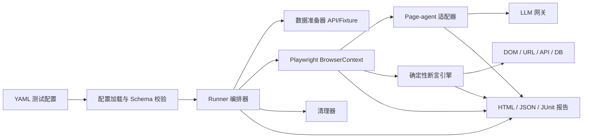
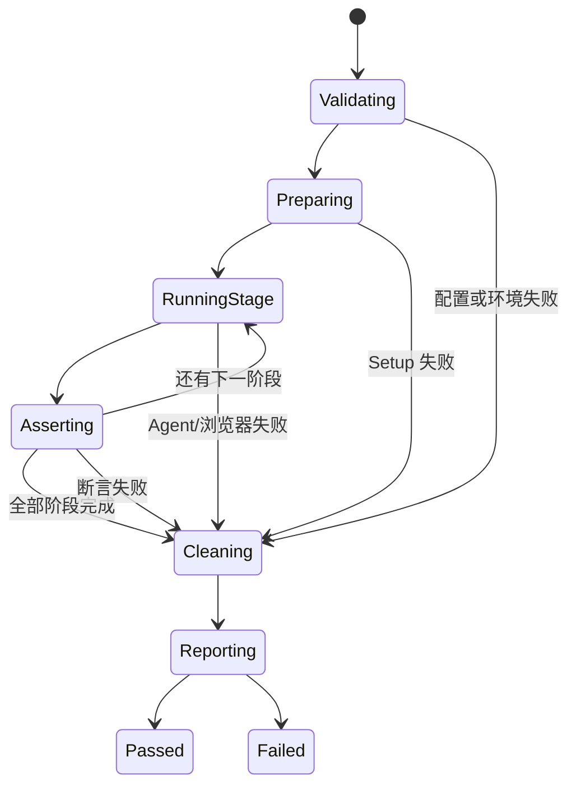

# FlowTest：AI 驱动业务回归测试平台实施方案

> 文档版本：v1.0<br>
> 编写日期：2026-07-19<br>
> 适用范围：公司内部 Web 业务系统、测试环境/预发布环境<br>
> 项目名称：FlowTest

## 1. 决策摘要

这个项目适合先做成一个**配置驱动的 AI E2E 测试 Runner**，而不是一开始就做完整测试 SaaS。

推荐的产品形态是：

1. Playwright 启动真实浏览器并管理登录态、页面生命周期、网络、截图和录像。
2. Page-agent 读取当前页面 DOM，根据自然语言任务完成点击、输入、选择、提交等业务操作。
3. YAML 配置文件描述测试环境、业务参数、操作阶段、验收规则和清理规则。
4. Playwright、HTTP API 或测试数据库执行确定性断言，决定用例最终通过或失败。
5. Runner 输出 HTML、JSON、JUnit 报告，接入公司现有 CI。

核心原则只有一句：

> AI 负责“怎样完成操作”，确定性代码负责“结果是否正确”。

这样既能减少传统 E2E 脚本对选择器和页面结构的依赖，又不会把发布门禁交给不稳定的模型判断。

## 2. 项目背景与目标

### 2.1 目标问题

公司项目每次开发完成后，通常需要重复执行一批固定业务流程，例如：

- 创建订单并提交审批；
- 新建客户、编辑资料并查询；
- 创建活动、配置规则并发布；
- 后台审核、驳回、重新提交；
- 不同角色登录后检查数据状态；
- 表单录入、列表筛选、详情核对。

这些流程业务逻辑相对稳定，但页面元素、布局和文案会持续调整。纯 Playwright 用例容易积累大量选择器维护成本；完全交给 AI 又容易产生误判。因此采用“AI 操作 + 确定性验收”的混合架构。

### 2.2 MVP 目标

- 用一份 YAML 文件定义一个完整业务回归流程；
- 支持参数化执行，同一流程可使用不同账号和业务数据；
- 支持 Chromium，后续再扩展 Firefox/WebKit；
- 支持登录态复用、页面截图、录像、Trace 和控制台日志；
- 支持 DOM、URL、HTTP API 结果等确定性断言；
- 支持 Page-agent 执行自然语言业务任务；
- 支持本地 CLI 和 CI 无头运行；
- 失败时能明确区分环境、AI 操作、业务断言和基础设施问题。

### 2.3 非目标

首版不解决以下问题：

- 性能测试、压力测试；
- 单元测试和纯 API 集成测试；
- 像素级视觉回归；
- Canvas、WebGL、复杂图表内容识别；
- 拖拽、悬停菜单、坐标点击、复杂富文本编辑器；
- 跨域 iframe 内部操作；
- 生产环境自主执行高风险操作；
- 让 AI 单独决定用例是否通过。

## 3. 用户与使用场景

### 3.1 主要用户

| 用户 | 主要诉求 |
|---|---|
| 开发工程师 | 提交代码前快速执行核心业务流程 |
| 测试工程师 | 用配置代替大量脆弱的选择器脚本 |
| CI/CD 平台 | 在合并、部署后自动执行回归门禁 |
| 业务/产品人员 | 阅读自然语言步骤和可视化失败报告 |

### 3.2 典型工作流

1. 测试人员创建 `cases/order-approval.yaml`。
2. 在配置中填写测试地址、登录态、变量、AI 任务和断言。
3. 本地执行：

```bash
flowtest run cases/order-approval.yaml --env staging
```

4. Runner 完成数据准备、页面操作、断言和清理。
5. 终端显示摘要，`artifacts/` 中生成报告和证据。
6. 用例稳定后加入 CI，在部署到测试环境后自动运行。

## 4. 产品形态与演进路线

### 阶段一：CLI Runner

首版只提供命令行、配置 Schema 和报告。这是最快验证价值的形态。

建议命令：

```bash
flowtest validate cases/order-approval.yaml
flowtest run cases/order-approval.yaml --env staging
flowtest run cases/order-approval.yaml --var orderType=standard
flowtest list cases/
flowtest report artifacts/run-20260719/
```

### 阶段二：CI 集成

- 输出 JUnit XML；
- 支持按标签选择 smoke/regression；
- 支持并发与队列；
- 支持 GitLab CI、GitHub Actions 或公司现有流水线；
- 失败报告作为构建产物保存。

### 阶段三：内部 Web 控制台

只有 CLI 已验证、用例数量达到 20～30 个后再建设：

- 用例列表和运行历史；
- 手动触发、定时执行；
- 环境变量和密钥引用管理；
- 失败步骤、截图、Trace 在线查看；
- 模型消耗、稳定率和 flaky 趋势；
- 用例配置在线编辑与审批。

## 5. 总体架构



### 5.1 组件职责

| 组件 | 职责 |
|---|---|
| Config Loader | 变量替换、环境合并、Schema 校验、密钥引用解析 |
| Runner | 编排 setup、stage、assertion、cleanup，管理超时和状态 |
| Playwright Adapter | 浏览器、Context、登录态、网络、截图、视频、Trace |
| Page-agent Adapter | 注入/初始化 Agent、发送任务、收集步骤与模型返回 |
| Assertion Engine | 执行 DOM、URL、HTTP、下载、数据库等确定性断言 |
| Reporter | 统一错误分类，生成 HTML、JSON、JUnit 和运行摘要 |
| Secret Provider | 从 CI Secret、环境变量或公司密钥系统读取敏感值 |

## 6. Page-agent 与 Playwright 的集成方式

### 6.1 V1：浏览器注入模式

首版建议把 Page-agent 打包成浏览器可执行的 IIFE 文件，通过 Playwright 的 `BrowserContext.addInitScript()` 注入。Playwright 会在新页面和页面导航时再次执行 init script，适合保证每次页面加载都有基础代码。

随后在每个业务阶段开始时，通过 `page.evaluate()` 初始化 Page-agent 并执行任务。

示意代码：

```ts
import { chromium } from "playwright";

const browser = await chromium.launch({ headless: true });
const context = await browser.newContext({
  storageState: "./auth/admin.json",
});

await context.addInitScript({
  path: "./dist/page-agent.iife.js",
});

const page = await context.newPage();
await page.goto(targetUrl);

const result = await page.evaluate(async ({ task, instructions, model, proxyUrl }) => {
  const agent = new window.PageAgent({
    baseURL: proxyUrl,
    model,
    instructions,
    customFetch: (url, init) => fetch(url, {
      ...init,
      credentials: "include",
    }),
  });

  return agent.execute(task);
}, { task, instructions, model, proxyUrl: "/internal/llm-proxy" });
```

注意：Page-agent 的核心库运行在当前页面 JavaScript 上下文中。如果一次任务触发整页跳转，原来的执行上下文可能被销毁。因此 V1 必须把跨页面流程拆成多个 `stage`：每个阶段只负责当前页面，跳转完成后由 Runner 等待新页面稳定，再重新初始化 Agent 并执行下一阶段。

### 6.2 V2：Node 侧 PageAgentCore + 自定义 PageController

当 V1 已证明业务价值，但跨页面导航、密钥隔离或运行稳定性成为瓶颈时，再实现基于 Playwright 的自定义 `PageController`：

- PageAgentCore 在 Node 进程中运行；
- PageController 使用 Playwright 获取 DOM 状态并执行点击、输入、滚动；
- 模型密钥不进入浏览器页面；
- 页面导航不会销毁整个 Agent 编排上下文；
- 可以更细粒度地控制网络、元素和审计日志。

这是更适合长期平台化的架构，但实现和维护成本高于注入模式，不建议作为第一周的工作。

### 6.3 什么时候不用 Page-agent

以下动作直接使用 Playwright 或后端接口更可靠：

- 登录态准备；
- 测试数据创建与清理；
- 文件上传和下载校验；
- 明确、稳定且高风险的按钮操作；
- Canvas、拖拽、跨域 iframe；
- 最终验收断言；
- 支付、删除、发信等副作用操作。

## 7. 测试配置设计

### 7.1 推荐 YAML 示例

```yaml
apiVersion: flowtest.ai/v1
kind: TestCase

metadata:
  id: order-approval-happy-path
  name: 创建订单并完成审批
  tags: [smoke, order, approval]
  owner: order-team

environment:
  baseUrl: ${BASE_URL}
  allowedHosts:
    - staging.example.internal
    - api-staging.example.internal

browser:
  engine: chromium
  headless: true
  locale: zh-CN
  viewport:
    width: 1440
    height: 900
  storageState: ./auth/admin.json
  timeoutMs: 30000

variables:
  customerName: 自动化客户-${RUN_ID}
  productName: 标准套餐
  quantity: 2

safety:
  environmentAllowlist: [test, staging]
  blockedSelectors:
    - '[data-action="real-payment"]'
    - '[data-action="permanent-delete"]'
  maxAgentStepsPerStage: 12
  maxModelCallsPerCase: 30

setup:
  - id: seed-customer
    type: http
    request:
      method: POST
      url: ${API_BASE_URL}/test-fixtures/customers
      headers:
        Authorization: Bearer ${secret:TEST_API_TOKEN}
      body:
        name: ${customerName}
    export:
      customerId: $.data.id

stages:
  - id: create-order
    url: ${BASE_URL}/orders/new
    waitUntil: networkidle
    agent:
      task: >-
        为客户“${customerName}”创建订单，选择“${productName}”，
        数量填写 ${quantity}，保存后进入订单详情页。
      instructions:
        - 只操作当前系统，不打开外部网站
        - 不执行真实支付或永久删除
        - 如果出现两个同名客户，选择 ID 为 ${customerId} 的记录
      expectedNavigation: /orders/
    assertions:
      - type: url
        matches: /orders/[0-9a-z-]+$
      - type: visible
        locator: '[data-testid="order-status"]'
      - type: text
        locator: '[data-testid="order-status"]'
        equals: 待审批
      - type: export
        name: orderId
        from: url
        pattern: /orders/([^/?]+)

  - id: approve-order
    url: ${BASE_URL}/orders/${orderId}
    agent:
      task: 审批通过当前订单，并确认页面状态变为“已审批”。
      instructions:
        - 只允许点击审批相关按钮
    assertions:
      - type: text
        locator: '[data-testid="order-status"]'
        equals: 已审批
      - type: http
        request:
          method: GET
          url: ${API_BASE_URL}/orders/${orderId}
          headers:
            Authorization: Bearer ${secret:TEST_API_TOKEN}
        expect:
          status: 200
          json:
            $.data.status: APPROVED
            $.data.quantity: ${quantity}

cleanup:
  always: true
  actions:
    - type: http
      request:
        method: DELETE
        url: ${API_BASE_URL}/test-fixtures/orders/${orderId}
        headers:
          Authorization: Bearer ${secret:TEST_API_TOKEN}
    - type: http
      request:
        method: DELETE
        url: ${API_BASE_URL}/test-fixtures/customers/${customerId}
        headers:
          Authorization: Bearer ${secret:TEST_API_TOKEN}

artifacts:
  screenshot: on-failure
  video: retain-on-failure
  trace: retain-on-failure
  console: true
  network: failures-only

retry:
  caseRetries: 0
  stageRetries: 1
  retryOn: [agent_navigation_failure, transient_network_error]
```

### 7.2 配置设计规则

- 所有配置必须经过 JSON Schema 或 Zod 校验后才能执行；
- `${secret:NAME}` 只保存引用，不把密钥写进 YAML 或报告；
- `setup` 和 `cleanup` 尽量使用测试 Fixture API；
- 每个 `stage` 必须有独立任务、超时和断言；
- `agent.task` 描述业务意图，不写 CSS/XPath；
- `assertions` 尽量使用稳定的 `data-testid`、API 状态或数据库状态；
- 不允许未声明的主机跳转；
- 用例层默认不自动重试，避免掩盖真实缺陷；只允许对已分类的瞬时错误进行一次阶段重试。

## 8. 断言体系

### 8.1 强断言：可以阻断发布

| 类型 | 示例 |
|---|---|
| URL | 跳转到 `/orders/{id}` |
| DOM 可见性 | 成功提示、状态标签出现 |
| 文本/属性 | 状态为“已审批”、按钮被禁用 |
| HTTP API | 后端订单状态为 `APPROVED` |
| 数据库只读查询 | 指定记录字段正确 |
| 下载文件 | 文件存在、类型和内容符合预期 |
| 网络请求 | 指定请求返回 2xx，Payload 正确 |

### 8.2 弱断言：只作为诊断信息

- “页面看起来像成功页”；
- “订单信息应该完整”；
- “布局没有明显异常”；
- 由模型对截图或 DOM 做语义判断。

弱断言可以辅助解释失败，但不应单独作为发布门禁。若确实需要语义断言，至少配一个确定性的后端状态或 DOM 断言。

### 8.3 防止假通过

- Agent 返回 `success` 只表示它认为任务完成，不代表用例通过；
- 每个关键业务阶段至少有一个强断言；
- 断言失败时禁止重试到“碰巧通过”；
- 用故意植入的缺陷验证用例确实能够失败；
- 对创建、审批、退款等状态流同时校验 UI 和后端状态。

## 9. Runner 状态机与错误分类

### 9.1 状态机



### 9.2 错误分类

| 错误码 | 含义 | 默认是否可重试 |
|---|---|---|
| `CONFIG_INVALID` | YAML 或 Schema 错误 | 否 |
| `ENV_UNAVAILABLE` | 环境、域名或依赖不可用 | 一次 |
| `AUTH_FAILED` | 登录态过期或账号异常 | 否 |
| `AGENT_MODEL_ERROR` | Tool call 格式、模型网关失败 | 一次 |
| `AGENT_TARGET_NOT_FOUND` | DOM 语义不足、元素不可操作 | 否 |
| `AGENT_NAVIGATION_FAILURE` | 页面跳转导致阶段未完成 | 一次 |
| `ASSERTION_FAILED` | 产品结果与规则不符 | 否 |
| `CLEANUP_FAILED` | 测试数据清理失败 | 可单独重试 |
| `INFRA_FAILURE` | 浏览器崩溃、Runner 异常 | 一次 |

报告必须显示“产品缺陷”和“测试基础设施失败”的区别，避免团队对 AI 测试失去信任。

## 10. 代码仓库建议

```text
flowtest-ai/
├── apps/
│   └── cli/
├── packages/
│   ├── config-schema/
│   ├── runner-core/
│   ├── playwright-adapter/
│   ├── page-agent-adapter/
│   ├── assertion-kit/
│   ├── secret-provider/
│   └── reporters/
├── cases/
│   ├── smoke/
│   └── regression/
├── environments/
│   ├── test.yaml
│   └── staging.yaml
├── auth/
│   └── .gitkeep
├── scripts/
│   └── build-page-agent-bundle.ts
├── examples/
├── artifacts/
├── package.json
└── pnpm-workspace.yaml
```

推荐使用 TypeScript monorepo。Playwright、Page-agent 和配置 Schema 都在 JavaScript/TypeScript 生态中，能够减少跨语言边界。

## 11. 登录、数据与环境管理

### 11.1 登录态

优先级从高到低：

1. 通过测试专用认证 API 创建登录态；
2. Playwright setup 项目登录并保存 `storageState`；
3. 每次用例通过 UI 登录。

UI 登录最慢且最容易受验证码、SSO 和 MFA 影响，不建议每条用例重复执行。登录态文件不得提交到 Git。

### 11.2 测试数据

- 为测试提供专用 Fixture API；
- 每次运行使用唯一 `RUN_ID`；
- 测试数据必须可重复创建、可清理；
- 清理逻辑放在 `finally`，即使用例失败也执行；
- 无法删除的数据加统一标签，由定时任务清扫；
- 不与人工测试共享固定账号和固定业务记录。

### 11.3 环境隔离

- 仅允许 `test`、`staging` 等明确环境；
- 域名必须命中 `allowedHosts`；
- Runner 默认拒绝生产域名；
- 邮件、短信、支付、外部 Webhook 使用 Mock 或 Sandbox；
- 删除、退款、发布等高风险动作需要显式开启能力。

## 12. 安全设计

### 12.1 密钥与数据

- LLM API Key、测试账号、Token 只从环境变量或公司密钥系统读取；
- 不将真实 API Key 写入注入到页面的 JavaScript；
- 注入模式使用公司后端 LLM Proxy，并在 Proxy 做身份校验、模型白名单、限流和审计；
- 报告生成前对 Cookie、Authorization、手机号、邮箱和业务敏感字段脱敏；
- 模型请求只发送完成任务所需的最小 DOM 信息。

### 12.2 Prompt Injection

页面文本可能包含恶意或意外指令。防护措施：

- 系统约束优先于页面内容；
- 只允许访问配置声明的主机；
- 默认移除任意 JavaScript 执行能力；
- 对自定义工具使用严格输入 Schema；
- 敏感动作不暴露给 Agent；
- 将“页面内容”明确标记为不可信数据；
- 对每次模型工具调用保留审计日志。

### 12.3 Page-agent 当前能力边界

Page-agent 官方文档说明其主要依赖 DOM，不具备视觉识别能力；悬停、拖拽、右键、坐标操作、跨域 iframe、Canvas 等不在核心支持范围内。官方的安全与权限能力仍标注为 Beta，因此平台必须在测试环境中再加一层自己的域名、工具和副作用控制，不能只依赖 Agent 内置权限。

## 13. 稳定性工程

### 13.1 让页面更适合 AI 操作

- 核心控件使用语义化 HTML；
- 表单字段提供 `label`、`aria-label`；
- 关键状态提供可读文本；
- 同名操作按钮补充上下文；
- 关键断言元素提供 `data-testid`；
- 弹窗和异步加载提供明确的 loading/ready 状态；
- 对 Agent 看不到的复杂组件提供稳定的自定义工具或 Playwright fallback。

### 13.2 等待策略

- 不使用固定 `sleep` 作为主要同步方式；
- 使用 URL、响应、DOM 状态、loading 消失等事件；
- 每个阶段设独立超时；
- Agent 完成后等待页面进入稳定状态，再开始断言；
- 网络长连接页面不要盲目依赖 `networkidle`。

### 13.3 稳定性基线

每个候选用例先重复执行 20 次：

- 成功率低于 90%：不进入 CI，先修复页面语义或任务拆分；
- 成功率 90%～95%：可进入非阻断流水线观察；
- 成功率达到 95% 且无假通过：可作为 smoke 门禁候选；
- 发布门禁用例还必须通过故障注入测试。

## 14. 报告设计

一次运行至少记录：

- 用例、版本、环境、Git Commit、触发人；
- 浏览器、模型标识、总模型调用次数和耗时；
- 每个阶段的自然语言任务；
- 每一步 Agent 动作及结果；
- 所有断言的预期值和实际值；
- 最终 URL、截图、视频、Trace；
- 失败请求、控制台错误；
- 清理结果；
- 统一错误分类和建议排查路径。

HTML 报告面向人，JSON 用于平台消费，JUnit 用于 CI 展示。

## 15. CI 接入示例

```yaml
ai-smoke-test:
  stage: verify
  script:
    - pnpm install --frozen-lockfile
    - pnpm exec playwright install --with-deps chromium
    - pnpm flowtest run "cases/smoke/**/*.yaml" --env staging
  artifacts:
    when: always
    paths:
      - artifacts/
    reports:
      junit: artifacts/junit.xml
  rules:
    - if: $CI_COMMIT_BRANCH
```

初期建议在部署完成后运行，但先设为非阻断；积累两周稳定性数据后，再选择 3～5 条核心用例作为阻断门禁。

## 16. MVP 范围

### 16.1 首批用例

选择 3～5 条满足以下条件的流程：

- 业务价值高；
- 人工执行频繁；
- 流程相对固定；
- 不涉及验证码、真实支付或复杂 Canvas；
- 页面有较好的语义结构；
- 后端有可查询的最终状态。

推荐组合：

1. 一个创建类流程；
2. 一个编辑类流程；
3. 一个审批状态流；
4. 一个跨角色流程；
5. 一个列表查询与详情核对流程。

### 16.2 MVP 必做功能

- YAML Schema 与校验命令；
- Playwright 浏览器和登录态；
- Page-agent 注入适配器；
- 多阶段任务；
- 变量与导出值；
- visible/text/url/http 断言；
- setup/cleanup HTTP 动作；
- 截图、Trace、JSON、JUnit；
- 域名白名单、敏感值脱敏；
- 一条 CI 示例流水线。

### 16.3 暂缓功能

- Web 控制台；
- 数据库写入动作；
- AI 自动生成整个测试用例；
- 自动修复失败用例；
- 多租户、计费和权限系统；
- 大规模浏览器集群；
- 任意第三方网站自动化。

## 17. 实施里程碑

### 第 0 阶段：可行性验证，3～5 天

- 选一个真实但安全的业务流程；
- Playwright 启动浏览器并加载登录态；
- 注入 Page-agent；
- 拆成 2～3 个 stage 执行；
- 使用 Playwright/API 完成最终断言；
- 重复执行 20 次，记录成功率和失败类型。

退出条件：至少一条真实流程达到 90% 以上成功率，且能识别一个故意制造的业务错误。

### 第 1 阶段：Runner MVP，第 1～3 周

- 建立 monorepo；
- 完成配置 Schema、变量、环境合并；
- 完成 Runner 状态机；
- 完成 Page-agent/Playwright 适配器；
- 完成基础断言和 artifacts；
- 实现 3 条真实用例。

### 第 2 阶段：CI 试运行，第 4～6 周

- JUnit、HTML 报告；
- 接入测试环境部署流水线；
- 增加测试数据 Fixture API；
- 建立错误分类、稳定率统计；
- 扩展到 5～10 条核心用例；
- 先非阻断运行两周。

### 第 3 阶段：稳定化，第 7～10 周

- 优化页面语义与可访问性；
- 增加网络/下载/数据库只读断言；
- 引入按错误类型重试；
- 成本、模型调用和执行时间监控；
- 选择 3～5 条用例变为发布门禁。

### 第 4 阶段：平台化，验证后再排期

- 决定是否实现 Node 侧自定义 PageController；
- Web 控制台、调度、历史趋势；
- 角色权限、密钥引用、运行队列；
- 用例模板和团队复用。

## 18. 验收指标

### 18.1 MVP 验收

- 至少 3 条真实业务流程能够通过 YAML 执行；
- 每条用例连续 20 次执行成功率不低于 95%；
- 植入业务错误后，强断言能够 100% 使测试失败；
- 不出现“Agent 报成功但强断言未执行”的假通过；
- 失败报告能在 5 分钟内帮助工程师判断问题所在阶段；
- 敏感值不出现在日志、截图文件名和报告文本中；
- 用例可在本地和 CI 使用同一配置执行。

### 18.2 业务效果指标

- 核心回归人工操作时间下降 50% 以上；
- 用例因页面小改动产生的维护次数低于传统选择器脚本；
- 测试失败中“基础设施/flaky”占比持续下降；
- 单次运行模型成本可观测，并低于团队可接受上限；
- 至少有一个真实缺陷在进入人工测试前被发现。

## 19. 主要风险与应对

| 风险 | 表现 | 应对 |
|---|---|---|
| 页面 DOM 语义差 | Agent 找不到或点错控件 | 补 label/ARIA、拆阶段、自定义工具或 Playwright fallback |
| 整页导航中断 Agent | 任务执行上下文销毁 | 一个页面一个 stage，导航后重新注入；后续实现 Node PageController |
| 模型输出不稳定 | Tool call 格式错误或路径漂移 | 固定兼容模型、限制步骤、明确指令、模型网关监控 |
| 假通过 | Agent 自报成功但业务未成功 | 强断言独立执行，故障注入验证 |
| 测试数据污染 | 多次运行互相影响 | RUN_ID、Fixture API、finally cleanup、定时清扫 |
| 敏感信息泄漏 | DOM、日志或模型请求带出数据 | 测试数据、脱敏、最小 DOM、内部 Proxy |
| 成本失控 | 大页面、多步骤、大量重试 | 页面裁剪、步骤上限、调用预算、缓存、失败即停 |
| 团队不信任 | flaky 过多、错误难定位 | 先非阻断、错误分类、证据完整、只把稳定用例设为门禁 |

## 20. 开工清单

### 第 1 周

- [ ] 确定一个最适合的真实业务流程；
- [ ] 建立 TypeScript + Playwright 项目；
- [ ] 构建 Page-agent 浏览器 bundle；
- [ ] 验证 `addInitScript` 和 `page.evaluate`；
- [ ] 把流程拆成多阶段；
- [ ] 加入一个 DOM 断言和一个 API 断言；
- [ ] 保存截图与 Trace；
- [ ] 连续执行 20 次并记录失败原因。

### 第 2 周

- [ ] 定义 YAML Schema；
- [ ] 实现变量、secret 引用和导出值；
- [ ] 实现 setup/cleanup；
- [ ] 实现统一错误分类；
- [ ] 增加另外两条流程；
- [ ] 输出 JSON/JUnit。

### 第 3 周

- [ ] 接入 CI 非阻断运行；
- [ ] 完成日志脱敏和域名白名单；
- [ ] 建立稳定性统计；
- [ ] 故意植入错误验证无假通过；
- [ ] 决定是否继续 V1，或开始设计 Node PageController。

## 21. 最终建议

先不要把项目包装成“万能 AI 自动化测试平台”。第一阶段只解决公司内 3～5 条高频核心业务流程，并把以下三件事做扎实：

1. 配置足够容易写；
2. 结果足够可信；
3. 失败足够容易排查。

如果 5～10 条真实用例在 CI 中稳定运行一个月，再建设 Web 控制台和更通用的插件体系。那时它才从一个工程工具演进为内部测试产品。

## 22. 参考资料

- [Page-agent Overview](https://alibaba.github.io/page-agent/docs/introduction/overview/)
- [Page-agent Limitations](https://alibaba.github.io/page-agent/docs/introduction/limitations/)
- [Page-agent PageController](https://alibaba.github.io/page-agent/docs/advanced/page-controller/)
- [Page-agent Custom Tools](https://alibaba.github.io/page-agent/docs/features/custom-tools/)
- [Page-agent Security & Permissions](https://alibaba.github.io/page-agent/docs/advanced/security-permissions/)
- [Page-agent Troubleshooting](https://alibaba.github.io/page-agent/docs/introduction/troubleshooting/)
- [Playwright BrowserContext.addInitScript](https://playwright.dev/docs/api/class-browsercontext#browser-context-add-init-script)
- [Playwright Page API](https://playwright.dev/docs/api/class-page)
- [Playwright Evaluating JavaScript](https://playwright.dev/docs/evaluating)
